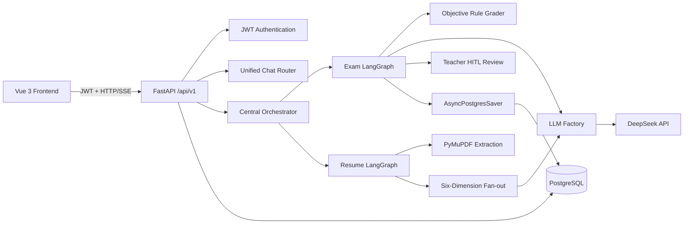

# ReviewDesk

> 面向个人与课题组的 AI 提效工作台：自动批改 Word 试卷，并基于目标岗位描述诊断 PDF 简历。

[](https://vuejs.org/)
[](https://fastapi.tiangolo.com/)
[](https://langchain-ai.github.io/langgraph/)
[](https://www.postgresql.org/)
[](LICENSE)

ReviewDesk 是一个多 Agent 个人提效系统。后端通过统一的 Orchestrator 编排 LangGraph Workflow，目前包含两个完整业务 Agent：

| Agent | 解决的问题 | 核心能力 |
| --- | --- | --- |
| Exam Agent | 试卷逐题人工批改重复、耗时长、反馈慢 | Word 答卷解析、客观题规则批改、简答题得分点评分、代码题 LLM 评估、薄弱知识点分析、教师复核发布 |
| Resume Agent | 秋招期间缺少低成本、随时可用的简历诊断工具 | PDF 文本抽取、结构化解析、六维度并行评审、问题清单生成、针对性修改建议 |

项目还提供统一 AI 助手入口，通过规则前置处理和 LLM 意图识别，将用户请求路由到 Exam Agent 或 Resume Agent。

## 项目背景

课题组教师长期依赖人工逐题批改课程试卷，重复性工作量大、反馈周期长；同时，个人在秋招准备过程中缺少低成本、可随时进行的简历诊断与修改工具。基于这两个实际需求，ReviewDesk 将试卷批改和简历审查抽象为两条可独立执行的 Agent Workflow，通过中心化编排、异步任务、结构化模型输出和 Human-in-the-Loop 复核，形成一套可持续扩展的个人提效工作台。

## 主要能力

### 1. Exam Agent：智能试卷批改

- 支持上传 `.docx` 学生答卷。
- 从 PostgreSQL 加载题目、标准答案、满分和知识点标签。
- 三轨并行批改：
  - 客观题：基于标准答案进行规则批改，并处理多选答案顺序。
  - 简答题：按预设得分点调用 LLM 结构化评分，输出逐得分点结果、总分和置信度。
  - 代码题：调用 LLM 评估代码正确性、思路、边界情况和改进建议。
- 聚合单题结果并生成学生薄弱知识点报告。
- 通过 LangGraph `interrupt` 暂停在教师复核节点。
- 教师可以：
  - 查看 AI 预批改总分和逐题结果；
  - 修改题目分数和评语；
  - 批准并发布最终成绩；
  - 查看全部学生提交及最终结果；
  - 删除已发布且存在错误的提交记录。
- 基于 `submission_id` 实现教师确认与成绩发布的幂等处理。
- 使用 `AsyncPostgresSaver` 持久化 LangGraph 中断状态，服务重启后仍可继续教师复核。

### 2. Resume Agent：简历审查

- 支持上传文本型 PDF 简历，单文件最大 20 MB。
- 用户需同时填写目标岗位名称和完整岗位描述。
- 使用 PyMuPDF 提取文本，并处理常见双栏 PDF 布局。
- 使用 Pydantic 约束简历结构化抽取结果。
- 六维度并行评审：
  1. 项目深度，权重 30%
  2. 技术匹配度，权重 25%
  3. 表达规范性，权重 15%
  4. 简历结构，权重 15%
  5. 量化程度，权重 10%
  6. 真实可信度，权重 5%
- 使用 `asyncio.gather` 并行执行六个维度评审。
- 汇总高优先级问题，生成改进建议和整体评价。
- 前端支持维度卡片和问题清单的展开、收起。

> 真实可信度维度仅识别明确事实矛盾、日期错误或明显夸大。在校期间实习、项目与课程时间重叠属于正常情况，不会仅因时间重叠判定为时间线冲突。

### 3. 统一 AI 助手

- 提供 SSE 流式输出接口 `POST /api/v1/chat/stream`。
- 常见问候、感谢、身份询问和能力询问使用规则前置处理，减少不必要的模型调用。
- 其他输入通过 LLM 判断意图并路由到 `exam`、`resume` 或 `clarify`。
- AI 回复由 LLM 生成并逐 token 流式返回。
- 当前系统不包含 QA Agent、面试 Agent 或其他知识库问答能力。

## 系统架构



### Orchestrator 编排层

`backend/core/orchestrator.py` 是系统的中心化 Agent 入口：

- 使用 `AgentType` 注册表统一标识当前支持的 Agent。
- 按需懒加载并缓存已编译的 LangGraph 图实例。
- 通过统一的 `Orchestrator.run()` 执行普通 State 或 `Command(resume=...)`。
- 可选启用统一重试与降级策略。
- API 层只负责鉴权、参数校验、数据库记录和初始 State 构造。

### LangGraph Workflow

Exam Agent：

```text
parse_word
  -> load_questions_meta
  -> run_three_tracks
  -> aggregate_results
  -> analyze_weak_points
  -> notify_teacher
  -> teacher_review [interrupt]
  -> apply_teacher_decision
  -> publish_results
  -> END
```

Resume Agent：

```text
upload_to_minio
  -> download_pdf
  -> extract_text
  -> extract_structured
  -> run_six_dimensions
  -> diagnose_issues
  -> generate_summary
  -> save_results
  -> END
```

其中 `upload_to_minio` 和 `download_pdf` 在本地模式下只保留扩展位，不依赖 MinIO；当前上传文件先写入系统临时目录，审查结果持久化到 PostgreSQL。

## 技术栈

### 前端

| 技术 | 用途 |
| --- | --- |
| Vue 3 + TypeScript | 页面与组件开发 |
| Vite | 开发服务器与生产构建 |
| Vue Router | 路由与登录、教师权限守卫 |
| Pinia | 登录状态管理 |
| Element Plus | UI 组件库 |
| Axios | HTTP 请求与 JWT 注入 |
| markdown-it + highlight.js | AI 回复 Markdown 渲染与代码高亮 |

### 后端

| 技术 | 用途 |
| --- | --- |
| Python 3.11 | 后端运行环境 |
| FastAPI | REST API 与 SSE 接口 |
| LangChain | 模型调用、消息与结构化输出 |
| LangGraph | Agent Workflow、状态图与 Human-in-the-Loop |
| DeepSeek OpenAI-compatible API | 意图识别、文本生成、简答题与代码题评估 |
| Pydantic v2 | 请求模型、配置和 LLM 结构化输出约束 |
| SQLAlchemy Async + asyncpg | 异步业务数据访问 |
| psycopg + AsyncPostgresSaver | LangGraph PostgreSQL 检查点持久化 |
| python-docx | Word 答卷解析 |
| PyMuPDF | PDF 简历文本提取 |
| python-jose + Passlib/bcrypt | JWT 鉴权与密码哈希 |

### 基础设施

| 技术 | 用途 |
| --- | --- |
| PostgreSQL 15 | 用户、试卷、提交、审查结果和 LangGraph 状态 |
| Docker Compose | 本地启动 PostgreSQL |

## 目录结构

```text
ReviewDesk/
├── backend/
│   ├── main.py
│   ├── config.py
│   ├── dependencies.py
│   ├── api/
│   │   ├── router.py
│   │   └── v1/
│   │       ├── auth.py
│   │       ├── exam.py
│   │       ├── resume.py
│   │       └── unified_chat.py
│   ├── agents/
│   │   ├── exam/
│   │   │   ├── graph.py
│   │   │   ├── nodes.py
│   │   │   ├── prompts.py
│   │   │   ├── review_hitl.py
│   │   │   └── state.py
│   │   └── resume/
│   │       ├── graph.py
│   │       ├── nodes.py
│   │       ├── prompts.py
│   │       └── state.py
│   ├── core/
│   │   ├── checkpoint.py
│   │   ├── exceptions.py
│   │   ├── llm_factory.py
│   │   ├── logger.py
│   │   ├── memory.py
│   │   ├── orchestrator.py
│   │   └── retry.py
│   └── db/
│       └── migrations.py
├── frontend/
│   ├── src/
│   │   ├── api/
│   │   ├── components/
│   │   ├── router/
│   │   ├── stores/
│   │   ├── styles/
│   │   ├── utils/
│   │   └── views/
│   ├── .env.example
│   ├── package.json
│   └── vite.config.ts
├── scripts/
│   ├── init_db.sql
│   ├── mock_exam_data.py
│   ├── mock_files/
│   └── seed_data.py
├── .env.example
├── docker-compose.yml
├── requirements.txt
├── run_backend.py
└── README.md
```

## 快速开始

### 环境要求

- Python 3.11
- Node.js 18 或更高版本
- Docker Desktop
- DeepSeek API Key
- Windows、Linux 或 macOS

> Windows 下必须通过 `python run_backend.py` 启动后端。psycopg 的异步模式要求 `SelectorEventLoop`，直接执行 `uvicorn backend.main:app` 可能因 `ProactorEventLoop` 启动失败。

### 1. 获取代码

```bash
git clone https://github.com/lxy0930/ReviewDesk.git
cd ReviewDesk
```

### 2. 创建 Python 环境

```bash
conda create -n reviewdesk python=3.11 -y
conda activate reviewdesk
pip install -r requirements.txt
```

也可以使用 `venv`：

```bash
python -m venv .venv
```

Windows PowerShell：

```powershell
.\.venv\Scripts\Activate.ps1
pip install -r requirements.txt
```

### 3. 创建本地配置文件

`.env.local` 不需要由仓库提供，它也不会出现在 GitHub 上。仓库只提供不包含真实密钥的模板文件 `.env.example`。第一次运行时，需要把模板复制成每个人自己的本地配置：

```text
.env.example              -> 后端配置模板，可以被 Git 跟踪
.env.local                -> 你本机的真实配置，禁止提交到 Git
frontend/.env.example     -> 前端配置模板，可以被 Git 跟踪
frontend/.env.local       -> 你本机的真实配置，禁止提交到 Git
```

以下命令都在项目根目录执行。

Windows PowerShell：

```powershell
Copy-Item .env.example .env.local
Copy-Item frontend/.env.example frontend/.env.local
```

macOS 或 Linux：

```bash
cp .env.example .env.local
cp frontend/.env.example frontend/.env.local
```

执行后，根目录下会出现一个新的后端配置文件 `.env.local`。用编辑器打开它，把占位值替换成自己的本地配置：

```ini
DB_HOST=localhost
DB_PORT=5433
DB_NAME=eduagent
DB_USER=reviewdesk
DB_PASSWORD=请替换成本地数据库密码

DEEPSEEK_API_KEY=请替换成你的DeepSeek_API_Key
JWT_SECRET_KEY=请替换成足够长的随机字符串
```

其中：

- `DB_USER` 和 `DB_PASSWORD` 会同时被 Docker PostgreSQL 和后端使用，两个地方必须保持一致。
- `DEEPSEEK_API_KEY` 必须填写，否则意图识别、试卷批改和简历审查无法调用模型。
- `JWT_SECRET_KEY` 用于登录令牌签名，生产环境必须使用随机值。
- `.env.local` 已被 `.gitignore` 忽略，不要把真实密钥提交到 GitHub。

前端配置文件 `frontend/.env.local` 默认内容如下：

```ini
VITE_API_BASE_URL=http://localhost:8000
```

本机开发保持 `localhost`。如果从局域网其他设备访问前端，需要改为后端所在机器的 IP，并同步调整后端 CORS 配置。

### 4. 启动 PostgreSQL

在项目根目录执行：

```powershell
docker compose --env-file .env.local up -d postgres
```

如果本机安装的是旧版 Compose，也可以执行：

```powershell
docker-compose --env-file .env.local up -d postgres
```

默认映射端口为 `5433`，与配置文件中的 `DB_PORT=5433` 保持一致。

查看状态：

```powershell
docker compose ps
```

停止服务：

```powershell
docker compose down
```

### 5. 初始化本地数据

确认 Python 环境已激活，并在项目根目录执行：

```powershell
python scripts/seed_data.py
python scripts/mock_exam_data.py
```

两个脚本均可重复执行：

- `seed_data.py` 创建本地测试账号。
- `mock_exam_data.py` 创建一套 20 题的 Python 基础试卷、6 个简答题得分点、3 份学生提交记录，并生成对应 Word 作答文件。

生成的 Word 文件位于：

```text
scripts/mock_files/
```

### 6. 启动后端

```powershell
python run_backend.py
```

默认地址：

- API：<http://localhost:8000>
- Swagger：<http://localhost:8000/docs>
- ReDoc：<http://localhost:8000/redoc>
- 健康检查：<http://localhost:8000/health>

### 7. 启动前端

打开另一个终端：

```powershell
Set-Location frontend
npm install
npm run dev -- --host 0.0.0.0
```

默认访问地址：

```text
http://localhost:3000
```

如果 `3000` 端口被占用，Vite 会自动切换到 `3001` 或其他可用端口。端口以终端输出为准。

## 测试账号

`scripts/seed_data.py` 会创建以下公开测试账号：

| 角色 | 用户名 | 密码 |
| --- | --- | --- |
| 管理员 | `admin` | `Admin@123456` |
| 教师 | `teacher01` | `Teacher@123456` |
| 学生 | `student01` | `Student@123456` |
| 学生 | `student02` | `Student@123456` |
| 学生 | `student03` | `Student@123456` |

这些凭据仅用于本地开发。正式部署前必须修改默认密码、JWT 密钥，并清理测试账号和示例数据。

## 环境变量

### 后端

| 变量 | 默认值 | 说明 |
| --- | --- | --- |
| `DB_HOST` | `localhost` | PostgreSQL 主机 |
| `DB_PORT` | `5433` | PostgreSQL 映射端口 |
| `DB_NAME` | `eduagent` | 数据库名 |
| `DB_USER` | 无 | 数据库用户名 |
| `DB_PASSWORD` | 无 | 数据库密码 |
| `DEEPSEEK_API_KEY` | 无 | DeepSeek API Key，禁止提交到 Git |
| `DEEPSEEK_BASE_URL` | `https://api.deepseek.com/v1` | OpenAI 兼容接口地址 |
| `DEEPSEEK_MODEL_CHAT` | `deepseek-chat` | 对话模型配置名 |
| `DEEPSEEK_MODEL_CODER` | `deepseek-coder` | 代码模型配置名 |
| `JWT_SECRET_KEY` | 无 | JWT 签名密钥，生产环境必须随机生成 |
| `JWT_ALGORITHM` | `HS256` | JWT 算法 |
| `JWT_ACCESS_TOKEN_EXPIRE_MINUTES` | `10080` | Token 有效期，默认 7 天 |
| `APP_ENV` | `local` | 运行环境 |
| `APP_DEBUG` | `false` | 调试模式 |
| `APP_HOST` | `0.0.0.0` | 后端监听地址 |
| `APP_PORT` | `8000` | 后端端口 |
| `LOG_LEVEL` | `INFO` | 日志级别 |

### 前端

| 变量 | 默认值 | 说明 |
| --- | --- | --- |
| `VITE_API_BASE_URL` | `http://localhost:8000` | 后端 API 地址 |

## API 概览

所有业务接口统一挂载在 `/api/v1` 下。除登录外，其余接口都需要：

```http
Authorization: Bearer <access_token>
```

### 认证

| 方法 | 路径 | 说明 |
| --- | --- | --- |
| `POST` | `/api/v1/auth/login` | 用户名或邮箱登录 |
| `GET` | `/api/v1/auth/me` | 获取当前登录用户 |

### AI 助手

| 方法 | 路径 | 说明 |
| --- | --- | --- |
| `POST` | `/api/v1/chat/stream` | SSE 流式意图识别与自然语言回复 |

### 试卷批改

| 方法 | 路径 | 说明 |
| --- | --- | --- |
| `POST` | `/api/v1/exam/submit` | 学生上传 Word 答卷并异步触发批改 |
| `GET` | `/api/v1/exam/my-submissions` | 查询本人提交记录 |
| `GET` | `/api/v1/exam/my-submissions/{submission_id}` | 查询本人批改状态或已发布结果 |
| `GET` | `/api/v1/exam/pending-reviews` | 查询待教师确认的提交 |
| `GET` | `/api/v1/exam/submissions` | 查询全部提交及批改状态 |
| `GET` | `/api/v1/exam/submissions/{submission_id}/review` | 获取 AI 预批改详情 |
| `GET` | `/api/v1/exam/submissions/{submission_id}/result` | 获取已发布最终结果 |
| `POST` | `/api/v1/exam/submissions/{submission_id}/confirm` | 教师批准或修改后发布成绩 |
| `DELETE` | `/api/v1/exam/submissions/{submission_id}` | 教师删除已发布提交 |

`confirm` 请求示例：

```json
{
  "action": "modify",
  "modifications": [
    {
      "question_id": "question-uuid",
      "new_score": 8,
      "comment": "核心逻辑正确，调整分数。"
    }
  ]
}
```

### 简历审查

| 方法 | 路径 | 说明 |
| --- | --- | --- |
| `POST` | `/api/v1/resume/upload` | 上传 PDF、目标岗位和岗位描述 |
| `GET` | `/api/v1/resume/reviews` | 查询本人历史审查 |
| `GET` | `/api/v1/resume/reviews/{review_id}` | 查询审查状态或报告 |
| `DELETE` | `/api/v1/resume/reviews/{review_id}` | 删除本人审查记录 |

## 数据模型

核心业务表：

| 表 | 说明 |
| --- | --- |
| `users` | 用户、角色、密码哈希和账号状态 |
| `exams` | 试卷元数据 |
| `questions` | 题目、标准答案、分值和知识点 |
| `scoring_points` | 简答题得分点 |
| `exam_submissions` | 学生提交与批改状态 |
| `exam_reviews` | 逐题 AI、教师和最终评分结果 |
| `resume_reviews` | 简历结构化数据、六维评分、问题和总结 |

LangGraph 的 checkpoint 表由 `AsyncPostgresSaver.setup()` 在同一个 PostgreSQL 数据库中自动创建，用于保存 Exam Agent 的中断状态和历史检查点。

## 幂等与容错

### 试卷提交幂等

- `exam_submissions` 使用 `UNIQUE (exam_id, student_id)` 防止同一学生重复提交同一试卷。
- 重复提交时，接口返回已有 `submission_id` 和状态，并设置 `already_submitted: true`。
- 后台批改失败时，状态会从 `ai_processing` 回滚为 `submitted`，允许重新处理。

### 教师确认与发布幂等

- 确认前检查提交状态。
- 如果成绩已经发布，直接返回已有最终结果，不重复写入。
- 发布时按 `submission_id + question_id` 先删后插，避免重复记录。

### 统一重试

`backend/core/retry.py` 为 Orchestrator 执行入口提供可选重试：

- 默认最多重试 2 次，共 3 次尝试。
- 重试前分别等待 1 秒和 3 秒。
- 单次执行超时时间为 120 秒。
- 支持 Agent 级降级和系统级兜底响应。

### 后台任务保护

- API 模块使用模块级 `set[asyncio.Task]` 持有后台任务强引用，避免任务被 Python GC 提前回收。
- 任务结束后自动移除引用并清理临时文件。
- 简历审查存在超时兜底，避免记录长期停留在 `processing`。

## 工程化设计

- **身份认证**：JWT Bearer Token，前端自动注入请求头。
- **密码安全**：Passlib + bcrypt 哈希存储密码。
- **权限控制**：前端按角色限制教师页面；删除已发布提交时后端校验 `teacher` 或 `admin`。
- **统一 LLM Factory**：按 Agent 类型路由模型，缓存模型实例，统一超时与代理策略。
- **结构化日志**：统一 `get_logger()`，以事件名和键值对输出日志，降低问题定位成本。
- **数据库迁移**：启动时执行幂等 DDL 补丁，当前未引入 Alembic。
- **异步数据库访问**：SQLAlchemy Async + asyncpg，避免同步数据库调用阻塞事件循环。
- **文件解析线程池**：`python-docx` 和 PyMuPDF 的同步解析放入线程池，防止阻塞 FastAPI 事件循环。
- **Pydantic 约束**：简历结构、维度评分、简答评分和总结均使用结构化模型约束 LLM 输出。
- **SSE 流式响应**：AI 助手在生成过程中持续向前端推送 token，降低首字等待时间。

## 当前限制

- 当前只有 Exam Agent 和 Resume Agent，不包含 QA Agent、面试 Agent 或知识库检索。
- 简历审查只支持文本型 PDF；扫描件和纯图片 PDF 暂未接入 OCR。
- 试卷提交只支持 `.docx`，暂不支持在线答题或图片答卷。
- `word_minio_path` 和 `pdf_minio_path` 是兼容字段名，本地模式未实际接入 MinIO。
- Docker Compose 当前只包含 PostgreSQL，前后端需要在本机运行。
- 当前没有完整自动化测试套件，正式开源后建议补充单元测试、集成测试和前端构建检查。
- 部分教师查询与确认接口目前只校验登录状态。生产环境建议统一增加角色依赖，明确限定为 `teacher` 或 `admin`。
- 启动时自动执行的迁移是轻量 DDL 补丁，复杂 Schema 演进建议迁移到 Alembic。

## 开源前安全检查

在推送到 GitHub 前，必须确认以下内容没有进入版本库：

- `.env.local`、`.env` 或任何真实 API Key。
- 数据库密码和 JWT Secret。
- 真实简历 PDF、个人身份信息和手机号、邮箱。
- `frontend/node_modules/`、`frontend/dist/`。
- `__pycache__/`、`.pytest_cache/` 和其他本地缓存。
- 生成的日志、临时上传文件和后端临时检查点导出文件。

仓库根目录已提供 `.gitignore` 和 `.env.example`。首次提交前执行：

```powershell
git status
git diff --cached
```

逐项确认暂存内容，不要直接执行 `git add .` 后立即推送。

## 常见问题

### 为什么不能直接运行 `uvicorn backend.main:app`？

Windows 下 psycopg 异步模式与 `ProactorEventLoop` 不兼容。`run_backend.py` 会在 Uvicorn 创建事件循环前设置 `WindowsSelectorEventLoopPolicy`。

### 前端为什么运行在 3001？

Vite 默认使用 `3000`。如果端口被占用，它会自动选择下一个空闲端口，页面和 API 路径不需要因此修改。

### 前后端如何连接？

- 普通 HTTP 请求通过 `frontend/src/api/client.ts` 统一发起。
- `baseURL` 由 `VITE_API_BASE_URL` 和 `/api/v1` 拼接。
- 开发环境默认直连 `http://localhost:8000`。
- Vite 仍配置了 `/api -> http://localhost:8000` 的开发代理，作为未设置 `VITE_API_BASE_URL` 时的备用路径。
- SSE 需要持续连接，推荐使用 `VITE_API_BASE_URL` 直连后端。

### 为什么服务重启后还能继续教师复核？

Exam Agent 使用 `AsyncPostgresSaver` 将 LangGraph 中断状态写入 PostgreSQL。恢复执行时通过相同的 `thread_id` 读取检查点，并调用 `Command(resume=decision)` 继续流程。

### 为什么数据库里看不到 checkpoint 表？

这些表由 LangGraph 的 `AsyncPostgresSaver.setup()` 自动创建，名称由库管理。请确认后端已成功启动，并连接到了与 `.env.local` 一致的数据库。

## 贡献

欢迎提交 Issue 和 Pull Request。建议贡献流程：

1. Fork 仓库并创建功能分支。
2. 保持改动范围聚焦，不提交本地配置、密钥或真实简历。
3. 新增或修改 Agent 行为时，优先补充结构化输出约束和异常降级测试。
4. 修改前端后至少执行一次：

```powershell
Set-Location frontend
npm run build
```

5. 提交 PR 时说明背景、改动、验证方式和已知风险。

## License

本项目采用 [MIT License](LICENSE)。

Copyright (c) 2026 lxy0930
